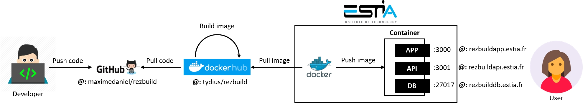

# DevOps

## Running develop branch locally

Open a terminal window:

1. Enter `cd common`
2. Enter `npm install`
3. Enter `npm run linkage`
4. Enter `cd ..`
5. Enter `cd react-trello`
6. Enter `npm install`
7. Enter `npm run linkage`

Open a terminal window:

1. Enter `cd api`
2. Enter `npm run linkage`
3. Enter `npm install`
4. Enter `npm run dev`

Open a terminal window:

1. Enter `cd app`
2. Enter `npm run linkage`
3. Enter `npm install`
4. Enter `npm run dev`

## Freezing develop branch locally

Open a terminal window:

1. Enter `npm shrinkwrap` after any stable package is installed

## Saving develop branch remotely

Open SourceTree software:

1. Click `BRANCHES > develop`
2. Click and Complete `File Status > Stage All > Push changes... > Commit`

Or open a git terminal:

1. Enter `git add *`
2. Enter `git commit -m '<your_message>'`
3. Enter `git push origin develop:master`

## Pushing develop branch to master branch remotely

Open a SourceTree software:

1. Click `BRANCHES > develop`
2. Click and Complete `File Status > Stage All > Push changes... > Commit`
3. Click and Complete `Git-flow > Start New Release > Release Name`
3. Click and Complete `Git-flow > Finish Release > Release Name`

Or open a Git Terminal:

1. Enter `git add *`
2. Enter `git commit -m '<your_message>'`
3. Enter `git push origin develop:master`

This proceduce will update the live version hosted at ESTIA (see <https://rezbuildapp.estia.fr>, <https://rezbuildapi.estia.fr>, <https://rezbuilddb.estia.fr>):

1. DockerHub (see <https://hub.docker.com/>) will automatically start building the lastest version of the GitHub repository into a Docker Image named `tydius/rezbuild` (see <https://hub.docker.com/r/tydius/rezbuild>)
2. The Docker at ESTIA will automatically download and run the lastest version of `tydius/rezbuild` thanks to ouroboros (see <https://github.com/pyouroboros/ouroboros>).

Testing the Docker image locally:

1. Open a Docker terminal
2. Enter `docker run -p 3000:3000 -p 3001:3001 -p 27017:27017 -p 8081:8081 --name rezbuild tydius/rezbuild`
3. Enter `docker run -d --name ouroboros -v /var/run/docker.sock:/var/run/docker.sock pyouroboros/ouroboros`